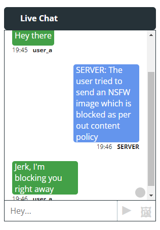

# Demo showing integration of Bumble's lewd image detector model into a Chat app

This is a simple demo showing integration of [Bumble's Lewd Image detector model](https://github.com/bumble-tech/private-detector) into a chat app. 

## What's the need for this project?
This project shows the power of using reusable lightning apps which Companies without an in-house ML team or necessary acumen can simply integrate into their existing workflows by doing an extremely simple thing like making an API call.

## Why this topic?
The topic is sensitive and serves as an important step in content moderation and cyber-flashing for social platforms. A lot of social media platforms still [employ people to do content moderation](https://www.livemint.com/news/india/inside-the-world-of-india-s-content-mods-11584543074609.html). A lot of effort has already been put into [AI based content moderation](https://www.forbes.com/sites/forbestechcouncil/2022/06/14/the-growing-role-of-ai-in-content-moderation/?sh=c7135534a178) approaches and is an active area of research. Automated content moderation ensures that no humans read your data (if users care about privacy) especially if harmful content is shared over chat applications for say - Dating platforms.

## Folder structure
1) `lewd-image-detector-lit-api`

This folder contains the codebase for the model deployment and FastAPI hosting using the Lightning framework

2) `react-socketio-chat-app`

**Note**: The socketio chat app is a clone of [this  repo](https://github.com/machadop1407/react-socketio-chat-app) (all credits for the original codebase to the author). All I've done here is make minor modifications to relay images along with text.

This folder contains two sub folders - `client` and `server`. 
Code in `server` directory is the socketio backend responsible for handling the chat data flow. `client` is the react app with a minimal chat interface where one can join a room, send text messages and images 

In order to successfully test the system, please run the API first, then the socketio server and finally the client apps.

## Running the API locally or on Lightning cloud

### Running locally

- Inside the `lewd-image-detector-lit-api` directory - download [this zip file]('https://storage.googleapis.com/private_detector/private_detector.zip'), unzip its contents. 

- Install lightning and packages in requirements.txt

- Run the following command
`lightning run app app.py`

### Running on lightning cloud

- Run the following command
`lightning run app app.py --cloud`

**Note**: The App URL given by lightning cloud is only for the swagger API docs and not the API URL. To obtain the API URL, just call the Health API from the swagger docs and in the dev console of the browser you shall see the actual API URL in the network call which is to be put into the SocketIO JS server. 

## Running the Chat app
I haven't dockerized the Chat app codebase but if you wish please go ahead and do so to be able to run it anywhere you wish

Prerequisites:
* You need to have node js and npm installed on your system. Follow [this guide](https://docs.npmjs.com/downloading-and-installing-node-js-and-npm) if not installed already for your respective OS

* Change directory to `react-socketio-chat-app`

* Inside the `server` directory, run the command `npm i` to install neessary js packages

* Inside the `client` directory, run the command `npm i` to install neessary js packages

* In the index.js file in the `server` directory, change the image model API URL with your own URL (local or cloud URL)

* Run the server first. Run the command: `npm start`. The server runs at localhost:3001

* Run the client. Run the command in a new terminal tab: `npm start`. Open URL localhost:3000 in two tabs, create 2 users join same chat room and test. 
The UI might be a bit buggy because the user suddenly gets disonnected from the socketio server, just refresh and it should start working again. Since this is for demo purposes, I'm not going deep into the JS aspect of the workflow. 

* Test away. Please run the demo responsibly.

A situation where the image sent by one party to another in the chat is classified as Lewd by the classifier API, the chat window for the user on the receiving end looks like this. 

If there are any suggestions/issues/improvements that can be made in the app, please create issues and I'll look into it. Thank you!!

## TODO
- [x] Write unit tests
- [x] Test on Lightning cloud